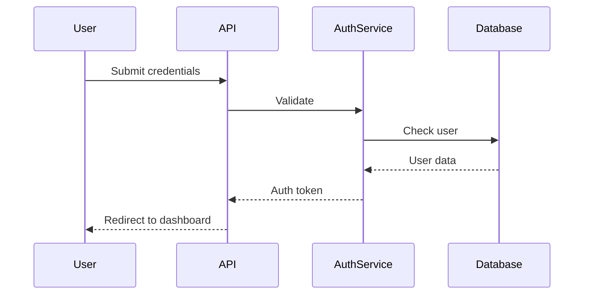

# Spec-Driven Development

This skill provides guidance for implementing a specification-first approach to software development, where requirements, design, and implementation plans are documented before code is written.

## Core Concept

Spec-driven development bridges the gap between conceptual product requirements and technical implementation by creating three interconnected artifacts that maintain alignment throughout the development process.

## The Three-Spec Structure

Every feature specification consists of three markdown files:

### 1. requirements.md - User Stories & Acceptance Criteria

Document user stories with acceptance criteria in EARS (Easy Approach to Requirements Syntax) notation.

**EARS Format:**
```
WHEN [condition/event]
THE SYSTEM SHALL [expected behavior]
```

**Examples:**

```markdown
## User Story: User Authentication

As a user, I want to log in securely so that I can access my account.

### Acceptance Criteria

WHEN a user submits valid credentials
THE SYSTEM SHALL authenticate the user and redirect to the dashboard

WHEN a user submits invalid credentials
THE SYSTEM SHALL display an error message and not grant access

WHEN a user submits a form with empty fields
THE SYSTEM SHALL display field-level validation errors

WHEN a user exceeds 5 failed login attempts
THE SYSTEM SHALL temporarily lock the account for 15 minutes
```

**Benefits of EARS notation:**
- Clear and unambiguous requirements
- Directly testable conditions
- Easy traceability from requirement to test
- Reduces misunderstandings between teams

### 2. design.md - Technical Architecture

Document the technical architecture, component interactions, and implementation considerations.

**Structure:**

```markdown
# [Feature Name] Design

## Overview
Brief description of the technical approach

## Architecture
- Components involved
- Data flow
- System interactions

## Sequence Diagrams

\```

## Data Models
- Schema definitions
- Database changes
- API contracts

## Implementation Considerations
- Security concerns
- Performance implications
- Error handling strategies
- Edge cases
```

### 3. tasks.md - Implementation Plan

Break down the work into discrete, trackable tasks with clear outcomes.

**Structure:**

```markdown
# Implementation Tasks

## Phase 1: Setup
- [ ] **Task 1.1**: Create database migration for user table
  - Expected outcome: Migration file creates users table with email, password_hash, failed_attempts, locked_until columns
  - Dependencies: None

- [ ] **Task 1.2**: Set up authentication middleware
  - Expected outcome: Middleware validates JWT tokens and attaches user to request
  - Dependencies: Task 1.1

## Phase 2: Core Authentication
- [ ] **Task 2.1**: Implement login endpoint
  - Expected outcome: POST /api/auth/login accepts credentials and returns JWT
  - Dependencies: Task 1.1, Task 1.2
  - References: requirements.md (login user story)

- [ ] **Task 2.2**: Add rate limiting logic
  - Expected outcome: Account locks after 5 failed attempts for 15 minutes
  - Dependencies: Task 2.1
  - References: requirements.md (rate limiting requirement)
```

## Workflow Phases

Follow this progression when building features:

```
Requirements → Design → Implementation Planning → Execution
```

### Phase 1: Requirements

1. Start with user stories describing the "what" and "why"
2. Define acceptance criteria in EARS notation
3. Ensure each requirement is testable
4. Review for completeness and clarity

**When requirements are unclear:**
- Ask clarifying questions
- Propose concrete examples
- Identify edge cases
- Validate with stakeholders

### Phase 2: Design

1. Review requirements thoroughly
2. Design technical architecture
3. Create sequence diagrams for key flows
4. Document data models and API contracts
5. Identify implementation considerations

**Design principles:**
- Keep designs focused and modular
- Document decisions and trade-offs
- Include diagrams for complex interactions
- Reference specific requirements being addressed

### Phase 3: Implementation Planning

1. Break design into discrete tasks
2. Define clear outcomes for each task
3. Identify dependencies between tasks
4. Map tasks to specific requirements
5. Order tasks logically

**Task characteristics:**
- Specific and actionable
- Independently testable
- Clear completion criteria
- 1-4 hours of work per task

### Phase 4: Execution

1. Work through tasks sequentially
2. Mark tasks as in-progress or completed
3. Update specs if requirements change
4. Validate implementation against requirements

## Property-Based Testing for Correctness

Property-based testing validates that implementations match specifications by testing universal properties rather than specific examples.

### What is a Property?

A property is a universal statement about system behavior that should always be true:

**Traditional test**: User adds Item #5 to cart, Item #5 appears in cart
**Property-based test**: For any user and any item, WHEN the user adds the item to cart, THE SYSTEM SHALL display it in their cart

### Mapping EARS to Properties

EARS requirements naturally translate to testable properties:

**EARS Requirement:**
```
WHEN a user submits a form with invalid email format
THE SYSTEM SHALL display email validation error
```

**Property:**
```
For any string that doesn't match email regex, submitting as email SHALL produce validation error
```

### Property-Based Testing Workflow

1. **Extract properties** from EARS requirements
2. **Determine testability** - which properties can be automatically tested
3. **Generate test cases** - create hundreds of random inputs
4. **Run tests** - validate implementation against properties
5. **Handle failures** - fix implementation, test, or requirement

**Benefits:**
- Catches edge cases you wouldn't manually test
- Validates implementation matches specification
- Provides evidence of correctness across input space
- Finds counter-examples through shrinking

**Note:** Property-based testing provides strong evidence but not formal proof of correctness.

## Best Practices

### Organizing Specs

**Multiple specs per project** - Create separate specs for different features:

```
specs/
├── user-authentication/
│   ├── requirements.md
│   ├── design.md
│   └── tasks.md
├── payment-processing/
│   ├── requirements.md
│   ├── design.md
│   └── tasks.md
└── admin-dashboard/
    ├── requirements.md
    ├── design.md
    └── tasks.md
```

**Benefits:**
- Work on features independently
- Maintain focused documentation
- Reduce merge conflicts
- Enable parallel development

### Version Control

Store specs in the same repository as the code:
- Keeps requirements and implementation together
- Enables requirement tracking across commits
- Makes specs reviewable in pull requests
- Provides historical context

### Iterating on Specs

Specs are living documents that evolve with the project:

1. **Update requirements.md** when needs change
2. **Refine design.md** to reflect requirement updates
3. **Update tasks.md** to map to new requirements
4. **Mark completed tasks** to track progress

### Importing Existing Requirements

If requirements exist in other systems (JIRA, Confluence, Word):

1. Copy existing requirements into a file
2. Generate spec from the document
3. Claude will structure them into EARS notation
4. Review and refine the generated spec

### Referencing Specs

When working on implementations, reference the relevant spec:
- Ensures code aligns with documented design
- Validates against acceptance criteria
- Provides context for architectural decisions
- Links implementation to requirements

**Example prompts:**
- "Implement task 2.3 from the user-authentication spec"
- "Does my implementation meet the acceptance criteria for user login?"
- "Update the design to include password reset flow"

## When to Use Spec-Driven Development

**Ideal for:**
- Features with clear business requirements
- Systems requiring traceability (compliance, auditing)
- Team collaboration across product and engineering
- Complex features needing upfront planning
- Projects where requirements clarity is critical

**Less suitable for:**
- Rapid prototyping and experimentation
- Simple, well-understood tasks
- Throwaway code or spikes
- Situations where requirements are highly uncertain

## Common Pitfalls

**Over-specification**: Don't document every trivial detail. Focus on non-obvious requirements and design decisions.

**Requirements without context**: Each requirement should connect to a user story or business need.

**Tasks too large**: Break down tasks into 1-4 hour chunks for better tracking and progress visibility.

**Stale specs**: Update specs when requirements change. Outdated specs are worse than no specs.

**Missing edge cases**: EARS notation makes edge cases explicit. Use "WHEN" clauses to capture error conditions and boundary cases.

## Integration with Development Workflow

1. **Planning**: Write specs before starting implementation
2. **Development**: Reference specs while coding
3. **Review**: Validate PRs against acceptance criteria
4. **Testing**: Generate tests from EARS requirements
5. **Documentation**: Specs serve as technical documentation

The spec becomes the source of truth for what was built, why it was built that way, and how it should behave.
