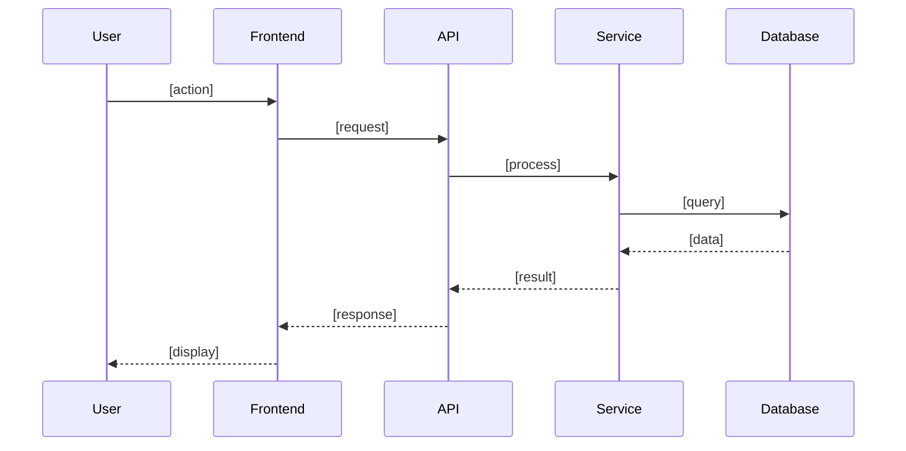

# [Feature Name] Design

## Overview

[High-level description of the technical approach]

## Architecture

### Components

- **[Component Name]**: [Purpose and responsibilities]
- **[Component Name]**: [Purpose and responsibilities]
- **[Component Name]**: [Purpose and responsibilities]

### Component Diagram

```
[Visual representation of components and their relationships]
```

## Data Flow



## Data Models

### [Entity Name]

```
{
  "field1": "type",
  "field2": "type",
  "field3": "type"
}
```

**Schema Changes:**
- [Database migration needed]
- [Index requirements]

### [Entity Name]

```
{
  "field1": "type",
  "field2": "type"
}
```

## API Contracts

### [Endpoint Name]

**Request:**
```
POST /api/[endpoint]
{
  "param1": "value",
  "param2": "value"
}
```

**Response:**
```
{
  "status": "success",
  "data": { }
}
```

**Error Cases:**
- [Error condition]: [HTTP status] - [Error response]

## State Management

[How application state will be managed]

## External Integrations

- **[Service Name]**: [How it's used and what data is exchanged]

## Implementation Considerations

### Security

- [Authentication/authorization approach]
- [Data encryption requirements]
- [Input validation strategy]

### Performance

- [Caching strategy]
- [Database optimization]
- [Expected load and scaling considerations]

### Error Handling

- [Error handling strategy]
- [Logging approach]
- [User-facing error messages]

### Edge Cases

- [Edge case 1 and how to handle it]
- [Edge case 2 and how to handle it]

## Testing Strategy

- **Unit Tests**: [What will be unit tested]
- **Integration Tests**: [What integrations need testing]
- **E2E Tests**: [Critical user flows to test end-to-end]

## Monitoring & Observability

- [Metrics to track]
- [Alerts to configure]
- [Logging requirements]

## Rollout Plan

- [Feature flags needed]
- [Gradual rollout strategy]
- [Rollback plan]

## Technical Debt & Future Considerations

- [Known limitations of this design]
- [Future improvements to consider]
