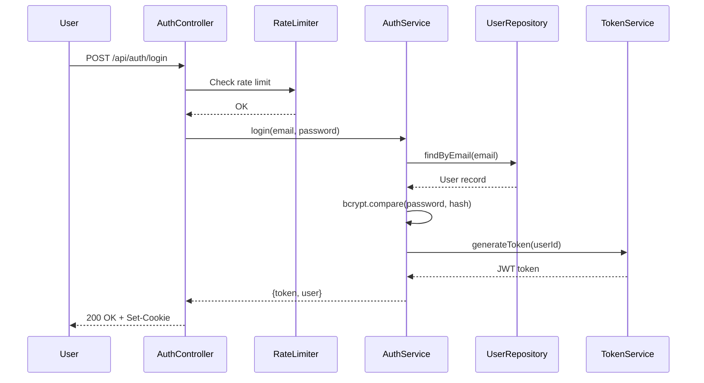

# Spec-Driven Development Workflow Examples

This reference provides concrete examples of how to use spec-driven development from start to finish.

## Example 1: Building a User Authentication Feature

### Starting from a User Request

**User request:** "We need to add user authentication to our app with login, signup, and password reset."

### Step 1: Create the Spec Directory

```bash
python scripts/init_spec.py user-authentication --path ./specs
```

This creates:
```
specs/user-authentication/
├── requirements.md
├── design.md
└── tasks.md
```

### Step 2: Document Requirements

**specs/user-authentication/requirements.md:**

```markdown
# User Authentication Requirements

## User Story

As a user,
I want to securely access my account
So that I can use the application's personalized features

## Context

The application currently has no authentication system. Users need a way to create accounts, log in, and recover access if they forget their password.

## Acceptance Criteria

### Account Creation

WHEN a user submits a signup form with valid email and password
THE SYSTEM SHALL create a new account and send a verification email

WHEN a user submits a signup form with an already registered email
THE SYSTEM SHALL display an error message without creating a duplicate account

WHEN a user's email contains uppercase letters
THE SYSTEM SHALL convert it to lowercase before storage

### Login

WHEN a user submits valid credentials
THE SYSTEM SHALL authenticate the user and create a session token

WHEN a user submits invalid credentials
THE SYSTEM SHALL display a generic error message and not reveal which field was incorrect

WHEN a user fails login 5 times within 15 minutes
THE SYSTEM SHALL temporarily lock their account for 15 minutes

### Password Reset

WHEN a user requests a password reset
THE SYSTEM SHALL send a reset link valid for 1 hour to their email

WHEN a user clicks a valid reset link
THE SYSTEM SHALL allow them to set a new password

WHEN a user clicks an expired or invalid reset link
THE SYSTEM SHALL display an error and offer to resend

### Session Management

WHEN a user is inactive for 30 minutes
THE SYSTEM SHALL automatically log them out

WHEN a user logs out
THE SYSTEM SHALL invalidate their session token immediately

## Non-Functional Requirements

### Security
- Passwords must be hashed using bcrypt with cost factor 12
- Session tokens must be cryptographically random
- All authentication endpoints must use HTTPS
- Rate limiting must prevent brute force attacks

### Performance
- Login should complete within 500ms under normal load
- Password hashing should not block other requests

### Usability
- Error messages should be clear but not reveal security details
- Password strength indicator should update in real-time
```

### Step 3: Design the Technical Solution

**specs/user-authentication/design.md:**

```markdown
# User Authentication Design

## Overview

Implement JWT-based authentication with email verification and password reset functionality. Use bcrypt for password hashing and Redis for session management.

## Architecture

### Components

- **AuthController**: Handles HTTP endpoints for signup, login, logout, password reset
- **AuthService**: Business logic for authentication operations
- **UserRepository**: Database access for user records
- **EmailService**: Sends verification and password reset emails
- **TokenService**: Generates and validates JWT tokens
- **RateLimiter**: Prevents brute force attacks using Redis

## Data Flow

### Login Flow



## Data Models

### User

```sql
CREATE TABLE users (
  id UUID PRIMARY KEY DEFAULT gen_random_uuid(),
  email VARCHAR(255) UNIQUE NOT NULL,
  password_hash VARCHAR(255) NOT NULL,
  email_verified BOOLEAN DEFAULT FALSE,
  failed_login_attempts INT DEFAULT 0,
  locked_until TIMESTAMP,
  created_at TIMESTAMP DEFAULT NOW(),
  updated_at TIMESTAMP DEFAULT NOW()
);

CREATE INDEX idx_users_email ON users(email);
```

### PasswordResetToken

```sql
CREATE TABLE password_reset_tokens (
  id UUID PRIMARY KEY DEFAULT gen_random_uuid(),
  user_id UUID REFERENCES users(id) ON DELETE CASCADE,
  token VARCHAR(255) UNIQUE NOT NULL,
  expires_at TIMESTAMP NOT NULL,
  used BOOLEAN DEFAULT FALSE,
  created_at TIMESTAMP DEFAULT NOW()
);

CREATE INDEX idx_reset_tokens_token ON password_reset_tokens(token);
CREATE INDEX idx_reset_tokens_expires ON password_reset_tokens(expires_at);
```

## API Contracts

### POST /api/auth/signup

**Request:**
```json
{
  "email": "user@example.com",
  "password": "SecurePass123!"
}
```

**Success Response (201):**
```json
{
  "message": "Account created. Please check your email to verify.",
  "userId": "uuid"
}
```

**Error Responses:**
- 400: Validation error (weak password, invalid email)
- 409: Email already registered

### POST /api/auth/login

**Request:**
```json
{
  "email": "user@example.com",
  "password": "SecurePass123!"
}
```

**Success Response (200):**
```json
{
  "token": "jwt-token-here",
  "user": {
    "id": "uuid",
    "email": "user@example.com"
  }
}
```

**Error Responses:**
- 401: Invalid credentials
- 429: Too many login attempts (account locked)

## Implementation Considerations

### Security

- Store JWT in httpOnly cookie to prevent XSS
- Implement CSRF protection
- Use secure random token generation for password resets
- Log all authentication attempts for security monitoring
- Implement email verification before allowing full access

### Performance

- Cache failed login attempts in Redis (15-minute TTL)
- Use connection pooling for database queries
- Index email column for fast lookups
- Set appropriate bcrypt cost factor (12) balancing security and performance

### Error Handling

- Never reveal whether email exists in database
- Use constant-time comparison for tokens
- Provide generic error messages for security
- Log detailed errors server-side for debugging

### Edge Cases

- Handle email case-insensitivity (convert to lowercase)
- Expire old password reset tokens automatically
- Handle race conditions in signup (unique email constraint)
- Clean up unused verification tokens after 7 days
```

### Step 4: Create Implementation Tasks

**specs/user-authentication/tasks.md:**

```markdown
# User Authentication Implementation Tasks

## Phase 1: Database & Infrastructure

- [ ] **Task 1.1**: Create database migrations
  - **Expected outcome**: Migration files create users and password_reset_tokens tables
  - **Dependencies**: None
  - **References**: design.md (Data Models)

- [ ] **Task 1.2**: Set up Redis for rate limiting
  - **Expected outcome**: Redis connection configured with proper timeouts and error handling
  - **Dependencies**: None

## Phase 2: Core Authentication

- [ ] **Task 2.1**: Implement UserRepository
  - **Expected outcome**: Repository with findByEmail, create, update methods
  - **Dependencies**: Task 1.1
  
- [ ] **Task 2.2**: Implement TokenService
  - **Expected outcome**: Service generates and validates JWT tokens
  - **Dependencies**: None
  - **References**: design.md (JWT configuration)

- [ ] **Task 2.3**: Implement AuthService signup
  - **Expected outcome**: Service creates user, hashes password, sends verification email
  - **Dependencies**: Task 2.1
  - **References**: requirements.md (Account Creation)

  - [ ] **Subtask 2.3.1**: Add password strength validation
    - **Expected outcome**: Validates password meets complexity requirements
  
  - [ ] **Subtask 2.3.2**: Add email format validation
    - **Expected outcome**: Validates email using regex pattern

- [ ] **Task 2.4**: Implement AuthService login
  - **Expected outcome**: Service validates credentials and returns JWT token
  - **Dependencies**: Task 2.1, Task 2.2
  - **References**: requirements.md (Login)

## Phase 3: Security Features

- [ ] **Task 3.1**: Implement RateLimiter
  - **Expected outcome**: Limits login attempts to 5 per 15 minutes using Redis
  - **Dependencies**: Task 1.2
  - **References**: requirements.md (Login - account locking)

- [ ] **Task 3.2**: Implement account locking mechanism
  - **Expected outcome**: Locks account after 5 failed attempts, auto-unlocks after 15 min
  - **Dependencies**: Task 3.1

- [ ] **Task 3.3**: Add session timeout
  - **Expected outcome**: Sessions expire after 30 minutes of inactivity
  - **Dependencies**: Task 2.2
  - **References**: requirements.md (Session Management)

## Phase 4: Password Reset

- [ ] **Task 4.1**: Implement password reset request endpoint
  - **Expected outcome**: Generates reset token and sends email
  - **Dependencies**: Task 2.1
  - **References**: requirements.md (Password Reset)

- [ ] **Task 4.2**: Implement password reset confirmation endpoint
  - **Expected outcome**: Validates token and updates password
  - **Dependencies**: Task 4.1

- [ ] **Task 4.3**: Add token cleanup job
  - **Expected outcome**: Cron job removes expired tokens daily
  - **Dependencies**: Task 4.1

## Phase 5: Testing & Deployment

- [ ] **Task 5.1**: Write unit tests for AuthService
  - **Expected outcome**: 90%+ code coverage for auth logic
  - **Dependencies**: Tasks 2.3, 2.4

- [ ] **Task 5.2**: Write integration tests for auth endpoints
  - **Expected outcome**: Tests cover all EARS requirements
  - **Dependencies**: All Phase 2-4 tasks
  - **References**: requirements.md (all sections)

- [ ] **Task 5.3**: Add authentication middleware
  - **Expected outcome**: Middleware validates JWT on protected routes
  - **Dependencies**: Task 2.2

- [ ] **Task 5.4**: Deploy to staging and run E2E tests
  - **Expected outcome**: All E2E tests pass in staging environment
  - **Dependencies**: All previous tasks
```

### Step 5: Execute Tasks

Work through tasks sequentially, updating status as you go:

```markdown
## Phase 1: Database & Infrastructure

- [✓] **Task 1.1**: Create database migrations
  - Completed: Created migration files for users and password_reset_tokens
  
- [→] **Task 1.2**: Set up Redis for rate limiting
  - In progress: Configuring Redis connection pooling
```

## Example 2: Iterating on an Existing Spec

### Scenario: Adding Two-Factor Authentication

**User request:** "We need to add 2FA to the existing authentication system."

### Step 1: Update Requirements

Add new EARS requirements to `specs/user-authentication/requirements.md`:

```markdown
### Two-Factor Authentication

WHEN a user enables 2FA
THE SYSTEM SHALL generate a QR code for authenticator app setup

WHEN a user logs in with 2FA enabled
THE SYSTEM SHALL prompt for a TOTP code after password verification

WHEN a user enters a valid TOTP code
THE SYSTEM SHALL grant access and create a session

WHEN a user enters an invalid TOTP code 3 times
THE SYSTEM SHALL lock the account temporarily

WHEN a user loses access to their 2FA device
THE SYSTEM SHALL allow recovery using backup codes generated at setup
```

### Step 2: Update Design

Add 2FA components to `specs/user-authentication/design.md`:

```markdown
### TwoFactorService

- Generates TOTP secrets
- Validates TOTP codes
- Generates backup codes

### Data Model Updates

```sql
ALTER TABLE users ADD COLUMN totp_secret VARCHAR(255);
ALTER TABLE users ADD COLUMN totp_enabled BOOLEAN DEFAULT FALSE;

CREATE TABLE backup_codes (
  id UUID PRIMARY KEY,
  user_id UUID REFERENCES users(id),
  code_hash VARCHAR(255),
  used BOOLEAN DEFAULT FALSE
);
```
```

### Step 3: Add New Tasks

Add implementation tasks to `specs/user-authentication/tasks.md`:

```markdown
## Phase 6: Two-Factor Authentication

- [ ] **Task 6.1**: Add 2FA fields to user model
  - **Expected outcome**: Migration adds totp_secret and totp_enabled columns
  - **Dependencies**: None

- [ ] **Task 6.2**: Implement TwoFactorService
  - **Expected outcome**: Service generates/validates TOTP codes
  - **Dependencies**: Task 6.1
  - **References**: requirements.md (Two-Factor Authentication)
```

## Example 3: Property-Based Testing Integration

### Converting EARS to Properties

**EARS Requirement:**
```
WHEN a user adds an item to their shopping cart
THE SYSTEM SHALL display it in their cart
```

**Property Test (Python with Hypothesis):**

```python
from hypothesis import given, strategies as st
import pytest

@given(
    user_id=st.uuids(),
    item_id=st.uuids(),
    quantity=st.integers(min_value=1, max_value=100)
)
def test_add_to_cart_property(user_id, item_id, quantity):
    """
    Property: For any user and any item, adding it to cart
    should make it appear in the cart.
    """
    # Arrange
    cart_service = CartService()
    
    # Act
    cart_service.add_item(user_id, item_id, quantity)
    cart_items = cart_service.get_cart(user_id)
    
    # Assert
    assert any(item.id == item_id for item in cart_items), \
        f"Item {item_id} not found in cart for user {user_id}"
    
    cart_item = next(item for item in cart_items if item.id == item_id)
    assert cart_item.quantity == quantity, \
        f"Expected quantity {quantity}, got {cart_item.quantity}"
```

This test automatically generates hundreds of random combinations of user IDs, item IDs, and quantities to validate the property holds universally.

## Best Practices Summary

1. **Start with requirements** - Don't jump to implementation
2. **Keep specs in version control** - They're part of your codebase
3. **Reference specs in PRs** - Link implementation to requirements
4. **Update specs when requirements change** - Keep them current
5. **Use task granularity wisely** - 1-4 hours per task is ideal
6. **Map tests to EARS requirements** - Maintain traceability
7. **Review specs with stakeholders** - Ensure alignment before coding
